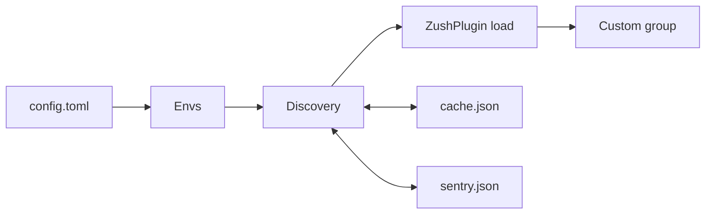
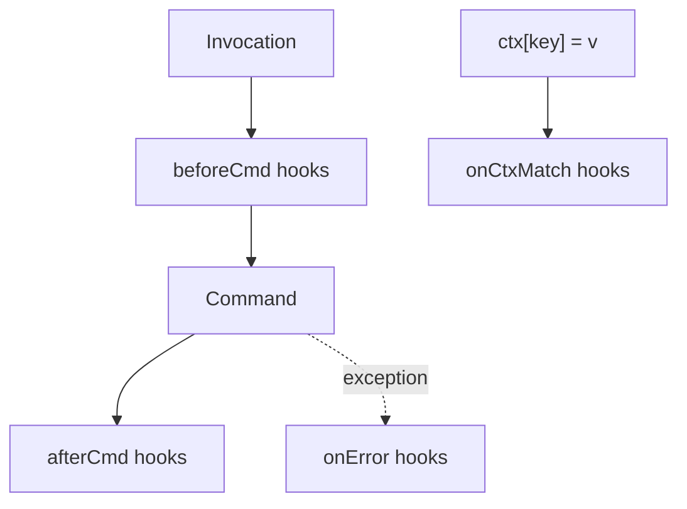

# System Patterns: zush

## Architecture (high level)

- **main()** parses argv for **--mock-path**; loads config; runs **Discovery** (with optional mock_path, no_cache when mock_path set).
- **Discovery**: Config envs (or single mock_path) → scan for prefix + `__zush__.py` → **ZushPlugin** load → return plugin list + merged tree; read/write cache and sentry unless no_cache.
- **Registration**: Merge plugin commands into ZushGroup (first-wins; skip any path under reserved **self**), then **add_reserved_self_group** (self + map command).
- **ZushCtx** is created per run, passed via ctx.obj; **hooks** (beforeCmd, afterCmd, onError, onCtxMatch) invoked by custom group and by ZushCtx on key set.

## Data flow

1. Parse argv for `--mock-path`; if set, use only that path and no_cache.
2. Read `~/.zush/config.toml` (envs, optional playground, env_prefix).
3. Run discovery: scan envs (or [mock_path]); for each package matching prefix with `__zush__.py`, load plugin; merge command tree; read/write cache and sentry unless no_cache.
4. Merge plugin commands into ZushGroup (first-wins; skip keys under `self`); add reserved **self** group with **map** command.
5. Register hooks from plugin instances; invoke CLI with remaining argv.

## Key paths

| Purpose    | Path / location |
|-----------|------------------|
| Config dir | `~/.zush/` |
| Config file | `config.toml` |
| Cache | `cache.json` |
| Sentry | `sentry.json` |
| Plugin marker | `__zush__.py` at package root |
| Plugin export | `ZushPlugin` with dict of name → ClickGroup/ClickCommand |

## Naming

- Plugin dict keys become the subcommand path (e.g. `some.one` → `zush some one`).
- Nested groups/commands: e.g. `is` command under `some.one` → `zush some one is wrong` when `wrong` is the command name.
- **Reserved**: Group name **`self`** is reserved; plugins cannot register under it. Built-in **`self`** group provides **`map`** (command tree).

## Hooks and ZushCtx

### Lifecycle

- **beforeCmd**: Invoked before the command runs; pattern is regex matched against the current command path.
- **afterCmd**: Invoked after the command returns successfully.
- **onError**: Invoked when an exception of the registered type (or subclass) is raised; custom group wraps invocation in try/except.
- **onCtxMatch**: Invoked synchronously inside ZushCtx’s `__setitem__` when a set makes `ctx["key"] == value` for a registered condition.

### ZushCtx as overloaded dict

- ZushCtx is (or wraps) a dict-like object with overridden `__setitem__` (and optionally `__delitem__`).
- On each set, check all registered onCtxMatch conditions (single-layer, key + expected value).
- Use equality (`==`) for matching; custom matchers can be added later.
- When a condition matches, run the corresponding hook(s) immediately.

### Custom group wiring

- Create and hold the single ZushCtx instance per invocation.
- Before invoking a command: run beforeCmd hooks whose regex matches the command path.
- Invoke the command.
- After success: run afterCmd hooks that match.
- On exception: run onError hooks for the exception type.
- Pass ZushCtx into commands via Click context (e.g. `ctx.obj = zush_ctx`).

### Diagram

## Plugin hook registration

- Plugin is initialized as an instance in `__zush__.py`.
- When loading the plugin, infer which hooks to register by **instance type** (inspect the loaded instance and register beforeCmd/afterCmd/onError/onCtxMatch based on its type or attributes).
