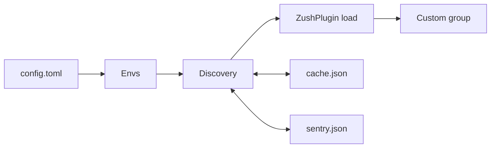
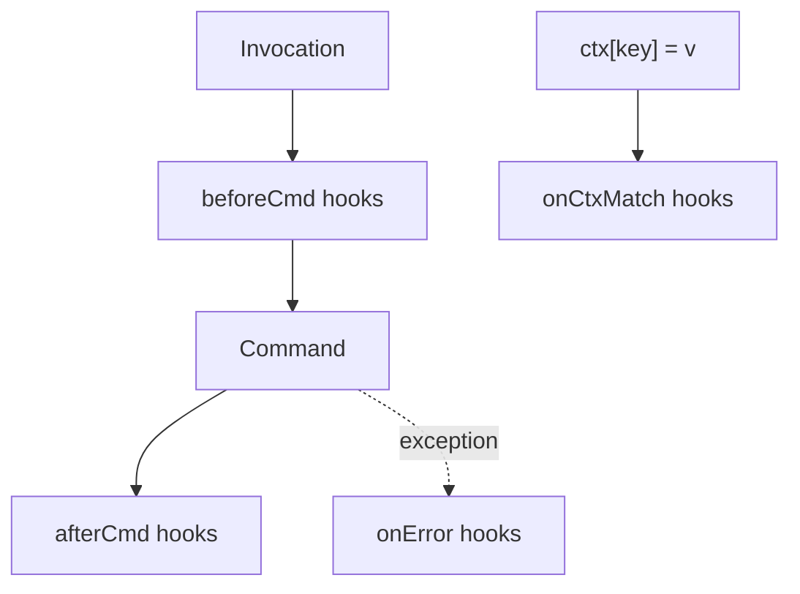

# System Patterns: zush

## Architecture (high level)

- **main()** parses argv for **--mock-path**; loads config; runs **Discovery** (with optional mock_path, no_cache when mock_path set).
- **Discovery**: Config envs (or single mock_path) → scan for prefix + `__zush__.py` → **ZushPlugin** load → return plugin list + merged tree; read/write cache and sentry unless no_cache.
- **Registration**: Merge plugin commands into ZushGroup (first-wins; skip any path under reserved **self**), then **add_reserved_self_group** (self + map command).
- **ZushCtx** is created per run, passed via ctx.obj; **hooks** (beforeCmd, afterCmd, onError, onCtxMatch) invoked by custom group and by ZushCtx on key set.

## Data flow

1. Parse argv for `--mock-path`; if set, use only that path and no_cache.
2. Read `~/.zush/config.toml` (envs, optional playground, env_prefix, include_current_env).
3. Run discovery: build envs_to_scan:
   - If `mock_path` is set, use only that path and disable cache.
   - Else: optionally add `playground`, then (if `include_current_env` is true) add current interpreter site-packages via `envs.current_site_package_dirs()`, then append explicit `envs`.
  For each env, scan for packages matching prefix with `__zush__.py`, load plugin, merge command tree, and read/write cache and sentry unless no_cache. If an env is unchanged according to sentry, discovery should rehydrate plugin packages from cached package paths instead of skipping live registration entirely.
4. Merge plugin commands into ZushGroup (first-wins; skip keys under `self`); add reserved **self** group with **map** command.
5. Register hooks from plugin instances; invoke CLI with remaining argv.

## Key paths and storage

- **Default**: Config dir `~/.zush/`; config file `config.toml`; cache `cache.json`; sentry `sentry.json`.
- **Pluggable**: **ZushStorage** protocol provides config_dir(), config_file(), cache_file(), sentry_file(). Default implementation = current paths. When embedding, caller can pass a storage (e.g. different base path). Config and cache modules accept optional storage; discovery passes storage through.
| Plugin marker | `__zush__.py` at package root |
| Plugin export | `ZushPlugin` with dict of name → ClickGroup/ClickCommand |

## Naming

- Plugin dict keys become the subcommand path (e.g. `some.one` → `zush some one`).
- Nested groups/commands: e.g. `is` command under `some.one` → `zush some one is wrong` when `wrong` is the command name.
- **Reserved**: Group name **`self`** is reserved; plugins cannot register under it. Built-in **`self`** group provides **`map`** (command tree).
- For migrations, discovery is anchored to the installed package directory name in the scanned env. If `env_prefix = ["applewood_"]`, the reliable layout is `applewood_.../__zush__.py` inside the installed package; do not assume a separate sibling package will be discovered unless packaging and config are updated for that exact name.
- Cache/sentry are performance shortcuts, not alternate sources of truth for the CLI tree. The live command graph must still be reconstructed for unchanged envs from cached package paths.

## Internal utility delegation

- Shared helper implementations that are not part of the public API can live under `src/zush/utils/`.
- Feature modules such as discovery, persistence, group, envs, plugin loading, and CLI bootstrap may keep their existing local helper names but delegate the actual implementation to the matching utility module to reduce clutter without changing behavior.
- Prefer focused utility modules by concern instead of a catch-all helper file. Current examples: CLI arg parsing, plugin runtime wiring, plugin instance discovery, group tree/merge helpers, discovery tree helpers, and persistence serialization helpers.
- For discovery specifically, keep `run_discovery()` as the high-level orchestration entry point and move env list construction, live env scanning, cached path recovery, and tree merge helpers into `utils/discovery.py`.
- If tests monkeypatch a module-level compatibility surface (for example `zush.discovery.paths`), preserve that attribute even when the implementation has been delegated elsewhere.

## Runtime object and service model

- `ZushCtx` remains invocation-scoped and is attached to Click as `ctx.obj`.
- `zush.runtime.g` is process-local and intended for live shared objects during a single zush process.
- Detached services are a separate concept from runtime globals: service definitions come from plugins, control is owned by zush, and persisted state lives in `services.json`.
- Built-in service control lives under `self services`; plugins declare the service interface, but zush performs start/stop/restart/status actions.
- Detached service integration should be validated with a real subprocess-backed app when behavior matters. Current coverage uses a temporary Flask app plus `httpx`-driven transactional endpoints to prove the full lifecycle works end to end.

## Hooks and ZushCtx

### Lifecycle

- **beforeCmd**: Invoked before the command runs; pattern is regex matched against the current command path.
- **afterCmd**: Invoked after the command returns successfully.
- **onError**: Invoked when an exception of the registered type (or subclass) is raised; custom group wraps invocation in try/except.
- **onCtxMatch**: Invoked synchronously inside ZushCtx’s `__setitem__` when a set makes `ctx["key"] == value` for a registered condition.

### ZushCtx as overloaded dict

- ZushCtx is (or wraps) a dict-like object with overridden `__setitem__` (and optionally `__delitem__`).
- On each set, check all registered onCtxMatch conditions (single-layer, key + expected value).
- Use equality (`==`) for matching; custom matchers can be added later.
- When a condition matches, run the corresponding hook(s) immediately.

### Custom group wiring

- Create and hold the single ZushCtx instance per invocation.
- Before invoking a command: run beforeCmd hooks whose regex matches the command path.
- Invoke the command.
- After success: run afterCmd hooks that match.
- On exception: run onError hooks for the exception type.
- Pass ZushCtx into commands via Click context (e.g. `ctx.obj = zush_ctx`).

### Diagram

## Plugin hook registration

- Plugin is initialized as an instance in `__zush__.py`.
- When loading the plugin, infer which hooks to register by **instance type** (inspect the loaded instance and register beforeCmd/afterCmd/onError/onCtxMatch based on its type or attributes).
